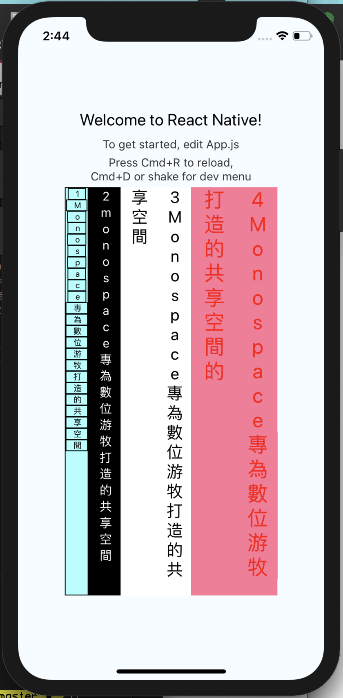

# react-native-vertical-text
A simple and fully customizable React Native component that
 implements a  vertical text UI. 
<!-- 

Example One             |  Example Two
:-------------------------:|:-------------------------:
| 
 -->

 &nbsp;&nbsp;&nbsp;&nbsp;&nbsp;&nbsp;&nbsp;&nbsp; &nbsp;&nbsp;&nbsp;&nbsp;&nbsp;&nbsp;&nbsp;&nbsp;&nbsp; 


## Installation

If using yarn:

```
yarn add react-native-vertical-text
```

If using npm:

```
npm i react-native-vertical-text
```

## Usage

```
import VerticalText from 'react-native-vertical-text';
```

Simply place a `<VerticalText />` tag for each desired


```

        <View style={{flexDirection:'row'}}>
  <VerticalText   style={{backgroundColor: '#aFFF', color: "black",fontSize: 10,borderWidth: 1,}} text={"1Monospace專為數位游牧打造的共享空間"}/>
         <VerticalText   style={{backgroundColor: 'black', color: "#FFF",fontSize: 15,borderWidth: 1,}} text={"2monospace專為數位游牧打造的共享空間"}/>
         <VerticalText   style={{backgroundColor: '#FFF', color: "black",fontSize: 20,}} text={"3Monospace專為數位游牧打造的共享空間"}/>
         <VerticalText   style={{backgroundColor: '#F79', color: "red",fontSize: 25,}} text={"4Monospace專為數位游牧打造的共享空間的"}/>


        </View>
       
```
<!-- 
### Button Styling Usage
Button container and text are fully customizable using the `nextBtnStyle, nextBtnTextStyle, previousBtnStyle, and previousBtnTextStyle` props.

Example usage to change a buttons text color: 

```
const buttonTextStyle = {
    color: '#393939'
};

return (
    <View style={{flex: 1}}>
        <ProgressSteps>
            <ProgressStep label="First Step" nextBtnTextStyle={buttonTextStyle} previousBtnTextStyle={buttonTextStyle}>
                <View style={{ alignItems: 'center' }}>
                    <Text>This is the content within step 1!</Text>
                </View>
            </ProgressStep>
            <ProgressStep label="Second Step" nextBtnTextStyle={buttonTextStyle} previousBtnTextStyle={buttonTextStyle}>
                <View style={{ alignItems: 'center' }}>
                    <Text>This is the content within step 2!</Text>
                </View>
            </ProgressStep>
        </ProgressSteps>
    </View>
)
``` -->


## Documentation

### verticalText Component
| Name                      | Description                              | Default     | Type   |
|---------------------------|------------------------------------------|-------------|--------|
| borderWidth               | Width for the text  | 6           | Number |
| borderStyle               | Type of border for the text     | solid       | String |
| backgroundColor           | backgroundColor for the text | #4bb543     | String |
| color                     | Color for the text       | #ebebe4     | String |
| fontSize                  | fontSize for the text size      | #ebebe4     | String |


## Contributing
Pull requests are always welcome! Feel free to open a new GitHub issue for any changes that can be made.

**Working on your first Pull Request?** You can learn how from this *free* series [How to Contribute to an Open Source Project on GitHub](https://egghead.io/series/how-to-contribute-to-an-open-source-project-on-github)

## Author
<!-- Colby Miller | [https://colbymillerdev.com](https://colbymillerdev.com) -->

## License
[MIT](./LICENSE)
